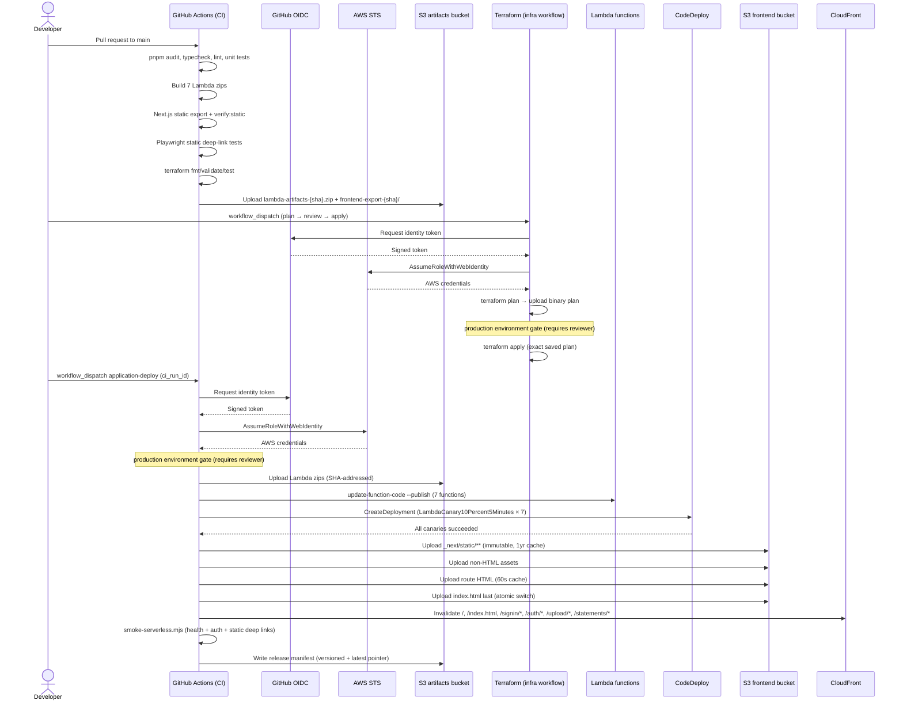
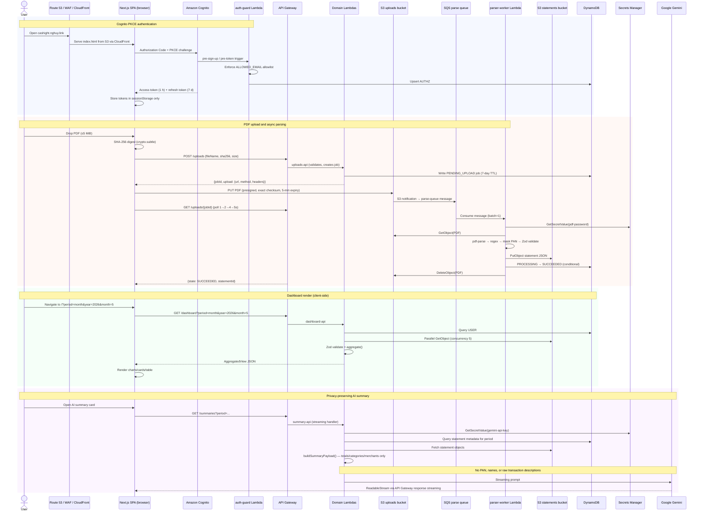

# Current AWS Architecture Diagrams

These diagrams describe the AWS architecture after the Phase 9 DNS cutover
(2026-06-29). The application runs as a static Next.js SPA on CloudFront/S3
with a serverless Lambda + API Gateway backend.

> **Migration history**: Prior to Phase 9, the application ran as an Amplify
> SSR WEB_COMPUTE deployment. The Amplify app and branch remain in place until
> Phase 10 decommission (seven healthy days post-cutover). See
> [`docs/runbooks/hybrid-serverless-migration.md`](runbooks/hybrid-serverless-migration.md).

The diagrams distinguish repository-defined infrastructure from external
services and manually provisioned runtime secrets. They do not claim that every
optional resource is enabled in every environment.

## 1. AWS deployment topology

This view shows the runtime, management, security, data, and observability
boundaries. Solid arrows represent request or data flow. Dashed arrows represent
identity, provisioning, or monitoring relationships.

```mermaid
flowchart TB
    user([User / Browser])
    engineer([DevOps Engineer])
    terraform["Terraform CLI\nAWS provider 6.x"]
    github["GitHub repository\nHuyNguyen260398/cashight"]

    subgraph external["External services"]
        google["Google OAuth\nCognito social IdP"]
        gemini["Google Gemini 2.5 Flash\nanonymized aggregates only"]
    end

    subgraph aws["AWS Account (010382427026, ap-southeast-1)"]
        subgraph edge["Global edge / us-east-1"]
            dns["Route 53 DNS\ncashight.nghuy.link → CloudFront\nnext.cashight.nghuy.link → CloudFront (staging)"]
            waf_cf["AWS WAF v2\nCloudFront scope\nmanaged rules + rate limit"]
            cf["CloudFront distribution\nSPA static assets\nOAC → S3 (private)"]
            acm_cf["ACM certificate\ncashight.nghuy.link + next.cashight.nghuy.link"]
        end

        subgraph region["ap-southeast-1"]
            spa[("S3 cashight-frontend-*\nprivate + AES256 + versioned\nno website endpoint")]

            cognito["Amazon Cognito\nUser Pool + Hosted UI\nGoogle IdP + SPA client (PKCE)"]
            auth_guard["Lambda auth-guard\npre-sign-up + pre-token\nALLOWED_EMAIL enforcement"]

            subgraph apigw["API Gateway REST API\napi.cashight.nghuy.link"]
                waf_api["WAF v2 Regional"]
                routes["Routes:\nGET /health\nGET /dashboard\nGET /statements\nGET /statements/{id}\nDELETE /statements/{id}\nPOST /uploads\nGET /uploads/{jobId}\nGET /summaries (streaming)"]
            end

            subgraph compute["Lambda functions"]
                uploads_api["uploads-api\nPresigned PUT + job creation"]
                upload_status["upload-status-api\nOwned job status reads"]
                parser_worker["parser-worker (reserved=2)\nSQS consumer\nTPBank PDF → Statement\nidempotent + partial batch"]
                statements_api["statements-api\nPaginated list + delete"]
                dashboard_api["dashboard-api\nPeriod aggregation"]
                summary_api["summary-api (streaming)\nPrivacy-safe Gemini prompts"]
            end

            dynamo[("DynamoDB cashight\nPAY_PER_REQUEST + PITR\nAuthZ records + statement metadata\nupload jobs + idempotency")]
            sqs["SQS parse-queue + DLQ\nvisibility=360s, maxReceive=3\n14-day DLQ retention"]
            statements[("S3 cashight-statements\nprivate + KMS + versioned\nusers/{sub}/statements/...")]
            uploads[("S3 cashight-uploads-*\nprivate + KMS\nuploads/{sub}/{jobId}.pdf\n1-day expiry")]
            artifacts[("S3 cashight-artifacts-*\nLambda zips + release manifests")]

            secrets["Secrets Manager\n/cashight/prod/gemini-api-key\n/cashight/prod/pdf-password\n/cashight/prod/google-oauth"]
            acm_api["ACM certificate\napi.cashight.nghuy.link (regional)"]

            amplify_standby["AWS Amplify (standby)\nSSR app + main branch retained\nfor Phase 10 decommission"]

            logs["CloudWatch Logs\nLambda log groups (30-day)\nAPI Gateway access logs"]
            alarms["CloudWatch alarms\nLambda errors/duration\nDLQ depth + SQS age\nAPI 4xx/5xx + CloudFront 5xx"]
            xray["AWS X-Ray\nservice map + traces"]
            sns["SNS email notification"]

            deployRole["IAM GitHub deploy role\nmain branch + production env trust"]
            oidc["GitHub OIDC provider\naccount-level"]

            tfstate[("S3 cashight-tfstate\nKMS-encrypted state + native lockfile")]
        end
    end

    user -->|HTTPS| dns --> waf_cf --> cf --> spa
    user -->|HTTPS auth| cognito
    cognito <-->|OpenID Connect| google
    cognito --> auth_guard

    user -->|HTTPS + Bearer token| waf_api --> routes
    routes -->|Cognito authorizer| cognito
    routes --> uploads_api --> dynamo
    routes --> upload_status --> dynamo
    routes --> statements_api --> dynamo
    routes --> statements_api --> statements
    routes --> dashboard_api --> dynamo
    routes --> dashboard_api --> statements
    routes --> summary_api --> secrets
    summary_api -->|privacy-filtered prompt| gemini

    uploads_api -->|presigned PUT| uploads
    uploads -->|S3 notification| sqs --> parser_worker
    parser_worker --> dynamo
    parser_worker --> statements
    parser_worker --> secrets

    deployRole -.->|upload zips, update functions| artifacts
    deployRole -.->|deploy frontend| spa
    deployRole -.->|CodeDeploy canary| compute
    deployRole -.->|CloudFront invalidation| cf

    compute -.->|logs + traces| logs
    compute -.->|traces| xray
    apigw -.->|access logs| logs
    alarms -->|when triggered| sns

    github -.->|signed identity token| oidc
    oidc -.->|AssumeRoleWithWebIdentity| deployRole

    engineer --> terraform
    terraform -->|state + locking| tfstate
    terraform -.->|provisions| cf
    terraform -.->|provisions| cognito
    terraform -.->|provisions| apigw
    terraform -.->|provisions| compute
    terraform -.->|provisions| dynamo
    terraform -.->|provisions| statements
    terraform -.->|provisions| waf_cf
    terraform -.->|provisions| alarms

    classDef awsService fill:#fff3e0,stroke:#e65100,color:#3e2723;
    classDef security fill:#ffebee,stroke:#c62828,color:#3e2723;
    classDef data fill:#e8f5e9,stroke:#2e7d32,color:#1b5e20;
    classDef externalNode fill:#e3f2fd,stroke:#1565c0,color:#0d47a1;
    classDef standby fill:#f5f5f5,stroke:#9e9e9e,color:#616161;

    class cf,cognito,auth_guard,routes,uploads_api,upload_status,parser_worker,statements_api,dashboard_api,summary_api,logs,alarms,xray,sns awsService;
    class waf_cf,waf_api,deployRole,oidc,secrets,acm_cf,acm_api security;
    class spa,statements,uploads,artifacts,dynamo,sqs,tfstate data;
    class user,engineer,terraform,github,google,gemini,dns externalNode;
    class amplify_standby standby;
```

IAM identity model:
- Each Lambda function has a **dedicated IAM role** scoped to exact resource ARNs.
- The GitHub **deploy role** is assumed via OIDC, restricted to the `production` environment and `main` branch.
- CloudFront accesses S3 only through **Origin Access Control** (sigv4; no public S3 endpoint).
- Cognito's `auth-guard` Lambda enforces the `ALLOWED_EMAIL` allowlist at sign-up and token generation.

## 2. CI/CD deployment sequence

This view follows `.github/workflows/infrastructure-deploy.yaml` and
`.github/workflows/application-deploy.yaml`.

## 3. Runtime data and security flow

This sequence combines authentication, PDF processing, dashboard, and
AI summarization. It highlights where sensitive financial data is constrained.

Privacy constraints enforced:
- Full PAN is masked to `cardLast4` inside the parser before any storage or logging.
- `buildSummaryPayload()` strips all raw transaction descriptions before the Gemini call.
- Lambda logs exclude email, names, tokens, secrets, PDF bytes, and raw descriptions (SEC-002).
- DynamoDB stores only `cardLast4`, not full transaction arrays (REQ-010).

## 4. Post-cutover resource map

| Concern | Repository evidence |
| --- | --- |
| CloudFront distribution, OAC, SPA router | `terraform/edge.tf` |
| Route 53 records (staging + production) | `terraform/edge.tf`, `var.cutover_dns_to_cloudfront` |
| ACM certificates (CloudFront + API GW) | `terraform/acm.tf` |
| Cognito User Pool, SPA client, Google IdP | `terraform/cognito.tf` |
| auth-guard Lambda (allowlist + DDB upsert) | `backend/functions/auth-guard/handler.ts` |
| API Gateway REST API (OpenAPI template) | `terraform/api.tf`, `terraform/api-openapi.yaml.tftpl` |
| Lambda functions (7) + aliases + CodeDeploy | `terraform/compute.tf` |
| DynamoDB table (statements, jobs, authz) | `terraform/data.tf` |
| SQS queue + DLQ + S3 notification | `terraform/data.tf` |
| Statements + uploads + artifacts S3 buckets | `terraform/data.tf`, `terraform/s3.tf` |
| Secrets Manager resources | `terraform/data.tf` |
| Lambda IAM roles (one per function) | `terraform/iam.tf` |
| CloudWatch logs/alarms/dashboards | `terraform/observability.tf`, `terraform/monitoring.tf` |
| GitHub OIDC deployment role | `terraform/github-oidc.tf` |
| Amplify (standby for Phase 10 removal) | `terraform/amplify.tf` |
| Terraform remote state (KMS-encrypted) | `terraform/backend.tf`, `terraform/state-security.tf` |
| CI pipeline | `.github/workflows/ci.yaml` |
| Infrastructure apply | `.github/workflows/infrastructure-deploy.yaml` |
| Application deployment (canary + frontend) | `.github/workflows/application-deploy.yaml` |
| Migration runbook | `docs/runbooks/hybrid-serverless-migration.md` |
| Statement migration scripts | `scripts/migrate-statements.ts`, `scripts/reconcile-statements.ts` |

## Other diagram options

| Format | Best use | Trade-off |
| --- | --- |--- |
| C4 context/container/deployment | Architecture governance and onboarding | Clear boundaries, but less AWS-resource detail |
| diagrams.net with official AWS icons | Presentations and stakeholder reviews | Strong visual polish, but manual updates can drift |
| Cloudcraft | AWS cost and topology discussions | AWS-focused and visual, but usually maintained outside Git |
| Python Diagrams | Reproducible SVG/PNG generation | Code-reviewable, but adds Python and Graphviz dependencies |
| Graphviz DOT | Precise automated graph layout | Powerful, but less approachable than Mermaid |

For this repository, Mermaid is the best default because the source remains
reviewable beside Terraform and renders directly in common Markdown tooling.
