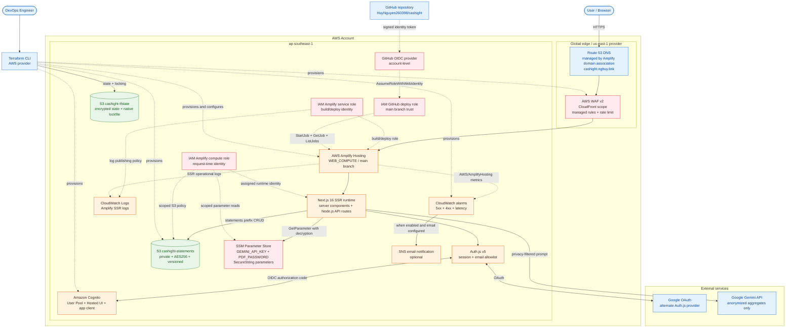
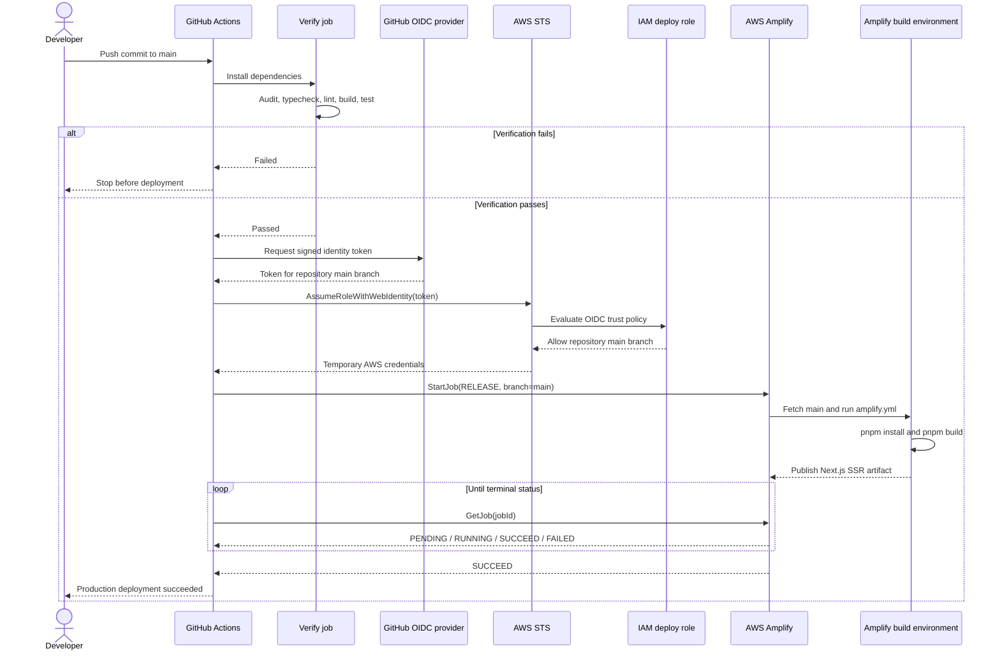
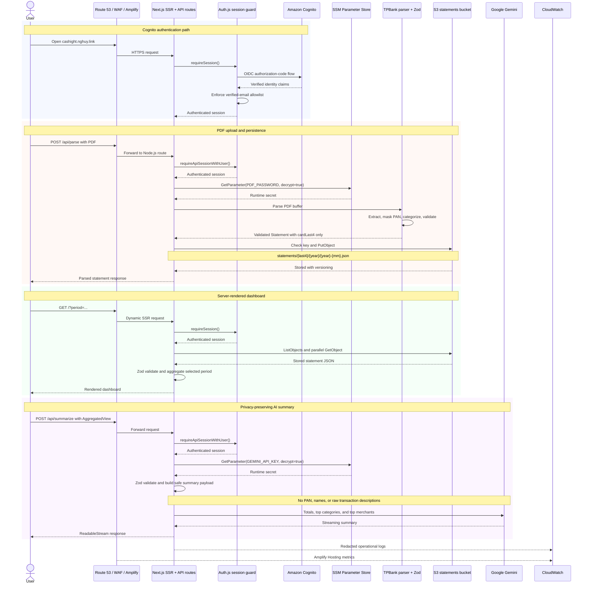

# Current AWS Architecture Diagrams

These diagrams describe the AWS architecture defined by the repository as of
2026-06-27. They are intended for DevOps and application engineers and are
copy-paste-ready for Mermaid-aware Markdown renderers.

The diagrams distinguish repository-defined infrastructure from external
services and manually provisioned runtime secrets. They do not claim that every
optional resource is enabled in every environment.

## 1. AWS deployment topology

This view shows the runtime, management, security, data, and observability
boundaries. Solid arrows represent request or data flow. Dashed arrows represent
identity, provisioning, or monitoring relationships.

Important IAM distinction:

- The Amplify **service role** is used for build/deploy and log publishing.
- The Amplify **compute role** is the request-time identity used by Next.js SSR
  to access S3 and SSM.
- The GitHub **deploy role** is assumed through OIDC and can only control
  Amplify release jobs for this application.

## 2. CI/CD deployment sequence

This view follows `.github/workflows/deploy.yaml`. The workflow verifies the
application before obtaining AWS credentials or triggering production.

Security properties represented above:

- GitHub receives short-lived AWS credentials; no long-lived AWS key is needed.
- The IAM trust policy is restricted to `HuyNguyen260398/cashight` on `main`.
- The deploy job cannot start until lint, build, type checking, audit, and tests
  complete successfully.
- Amplify native auto-build is disabled, keeping GitHub Actions as the sole
  production deployment trigger.

## 3. Runtime data and security flow

This sequence combines authentication, PDF processing, dashboard rendering, and
AI summarization. It highlights where secrets and sensitive financial data are
constrained.

The Google OAuth provider is an alternate sign-in path. The sequence uses
Cognito because it shows the AWS-native authentication flow.

## Source map

| Concern | Repository evidence |
| --- | --- |
| Amplify app, roles, branch, custom domain | `terraform/amplify.tf` |
| Cognito User Pool, Hosted UI, app client | `terraform/cognito.tf` |
| Statements storage controls | `terraform/s3.tf`, `lib/storage.ts` |
| Terraform remote state | `terraform/backend.tf` |
| Runtime S3 and SSM permissions | `terraform/iam.tf` |
| GitHub OIDC deployment role | `terraform/github-oidc.tf` |
| CloudFront-scoped WAF | `terraform/waf.tf` |
| CloudWatch alarms and optional SNS | `terraform/monitoring.tf` |
| Deployment gates and release trigger | `.github/workflows/deploy.yaml` |
| Amplify build and runtime env propagation | `amplify.yml` |
| Authentication and allowlist | `auth.ts`, `lib/require-session.ts` |
| Upload and privacy boundaries | `app/api/parse/route.ts`, `lib/parsers/tpbank.ts` |
| AI aggregate-only boundary | `app/api/summarize/route.ts`, `lib/summary-payload.ts` |

## Other diagram options

| Format | Best use | Trade-off |
| --- | --- | --- |
| C4 context/container/deployment | Architecture governance and onboarding | Clear boundaries, but less AWS-resource detail |
| diagrams.net with official AWS icons | Presentations and stakeholder reviews | Strong visual polish, but manual updates can drift |
| Cloudcraft | AWS cost and topology discussions | AWS-focused and visual, but usually maintained outside Git |
| Python Diagrams | Reproducible SVG/PNG generation | Code-reviewable, but adds Python and Graphviz dependencies |
| Graphviz DOT | Precise automated graph layout | Powerful, but less approachable than Mermaid |

For this repository, Mermaid is the best default because the source remains
reviewable beside Terraform and renders directly in common Markdown tooling.
