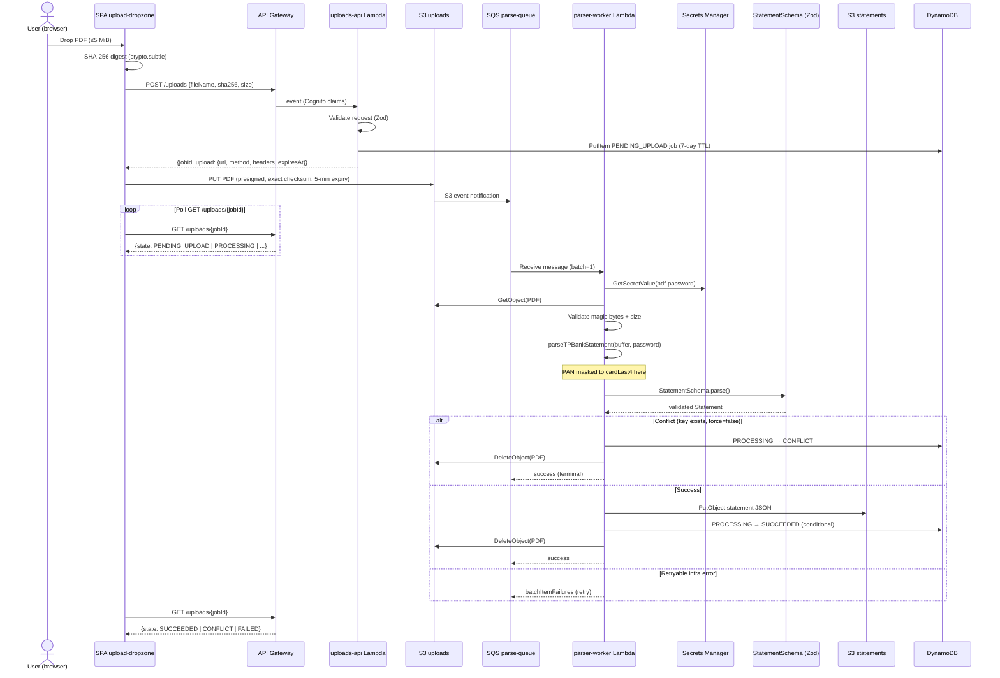
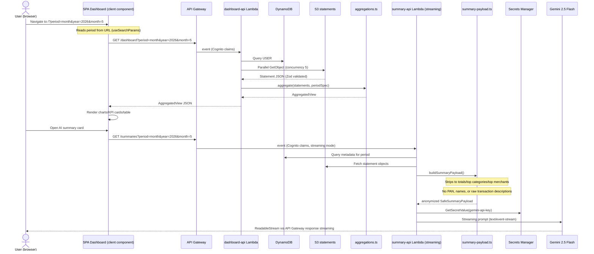
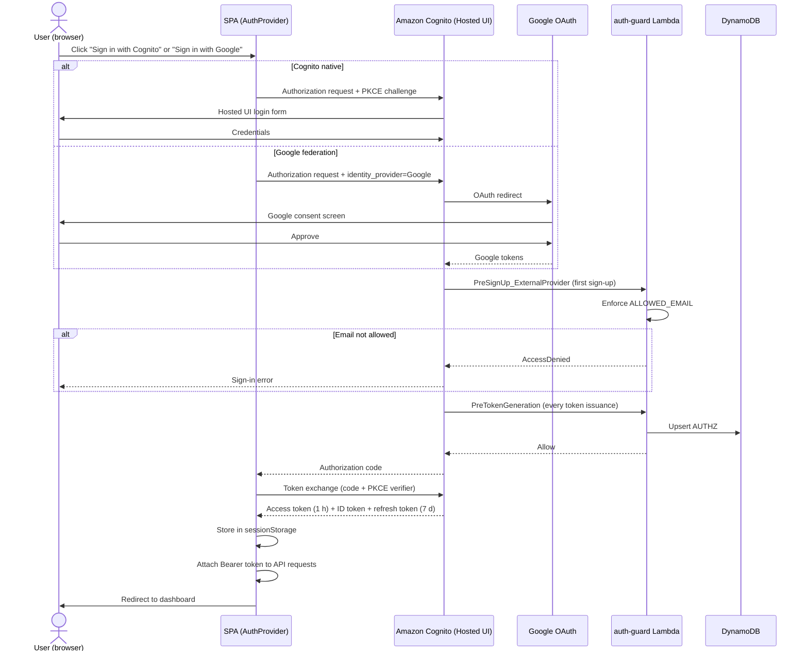

# Architecture Diagrams

Mermaid source for the Cashight architecture after Phase 9 DNS cutover (2026-06-29).
Each block is independently copy-paste-ready into [mermaid.live](https://mermaid.live)
or any Mermaid-aware renderer (GitHub, Obsidian, VS Code Mermaid preview).

> **Migration history**: the application previously ran as an Amplify SSR WEB_COMPUTE
> deployment. For the complete migration story see
> [`docs/plans/29-hybrid-serverless-migration.md`](../plans/29-hybrid-serverless-migration.md).

## 1. System architecture (flowchart)

```mermaid
flowchart TB
    user([User / Browser])

    subgraph spa["Static SPA (Next.js export, served from CloudFront/S3)"]
        auth_provider["AuthProvider\noidc-client-ts PKCE"]
        api_client["API client\nBearer token → api.cashight.nghuy.link"]
        upload["upload-dropzone.tsx\nSHA-256 + presigned PUT"]
        dash["Dashboard + charts\n(recharts, client component)"]
        aicard["ai-summary-card.tsx\nReadableStream"]
    end

    subgraph edge["Edge (CloudFront + WAF)"]
        cf["CloudFront\ncashight.nghuy.link"]
        s3fe[("S3 frontend\nstatic assets")]
    end

    subgraph apigw["API Gateway (api.cashight.nghuy.link)"]
        cognito_authz["Cognito authorizer\ncashight/read or cashight/write scope"]
        routes_api["Routes"]
    end

    subgraph lambdas["Lambda functions"]
        uploads_api["uploads-api\nPresigned URL + DDB job"]
        upload_status["upload-status-api\nOwned job reads"]
        parser_worker["parser-worker\nSQS consumer\npdf → Statement → S3"]
        statements_api["statements-api\nList + delete"]
        dashboard_api["dashboard-api\nPeriod aggregation"]
        summary_api["summary-api\nStreaming Gemini"]
        auth_guard["auth-guard\nCognito trigger"]
    end

    subgraph domain["packages/domain (pure, shared)"]
        parser["parsers/tpbank.ts\nregex + mask PAN"]
        categorize["categorize.ts"]
        schemas["schemas.ts\nZod boundary"]
        agg["aggregations.ts\ndashboard-aggregations.ts"]
        period["period.ts\nPeriodSpec"]
        payload["summary-payload.ts\nanonymize"]
    end

    subgraph data["Data stores"]
        dynamo[("DynamoDB\nmetadata + jobs + authz")]
        s3st[("S3 statements\nusers/{sub}/statements/...")]
        s3up[("S3 uploads\ntemp PDFs")]
        sqs["SQS parse-queue + DLQ"]
        secrets["Secrets Manager\nGemini key + PDF password"]
    end

    subgraph ext["External services"]
        cognito_idp["Amazon Cognito\nUser Pool + Google IdP"]
        gemini["Google Gemini 2.5 Flash"]
    end

    user --> cf --> s3fe
    user --> auth_provider --> cognito_idp --> auth_guard --> dynamo

    user --> api_client --> apigw
    apigw --> cognito_authz --> routes_api

    routes_api --> uploads_api --> dynamo
    routes_api --> upload_status --> dynamo
    routes_api --> statements_api --> dynamo
    routes_api --> statements_api --> s3st
    routes_api --> dashboard_api --> dynamo
    routes_api --> dashboard_api --> s3st
    routes_api --> summary_api --> dynamo
    routes_api --> summary_api --> s3st
    routes_api --> summary_api --> secrets
    summary_api --> payload --> gemini

    upload --> api_client
    upload --> s3up
    s3up --> sqs --> parser_worker
    parser_worker --> secrets
    parser_worker --> s3up
    parser_worker --> s3st
    parser_worker --> dynamo

    parser_worker --> parser --> categorize
    parser_worker --> schemas
    dashboard_api --> agg --> period

    dash -.->|delete/list| api_client
    aicard -.->|stream| api_client

    classDef pci fill:#ffe6e6,stroke:#c0392b;
    classDef pure fill:#e8f5e9,stroke:#2e7d32;
    classDef edge fill:#e3f2fd,stroke:#1565c0;
    class parser,payload pci;
    class categorize,schemas,agg,period pure;
    class cf,s3fe edge;
```

> Red nodes = PCI boundary (PAN masked / aggregates anonymized). Green = pure,
> side-effect-free modules. Blue = CloudFront edge.

## 2. Upload & async parse flow (sequence)

## 3. Dashboard render & AI summary (sequence)

## 4. Authentication flow (sequence)

