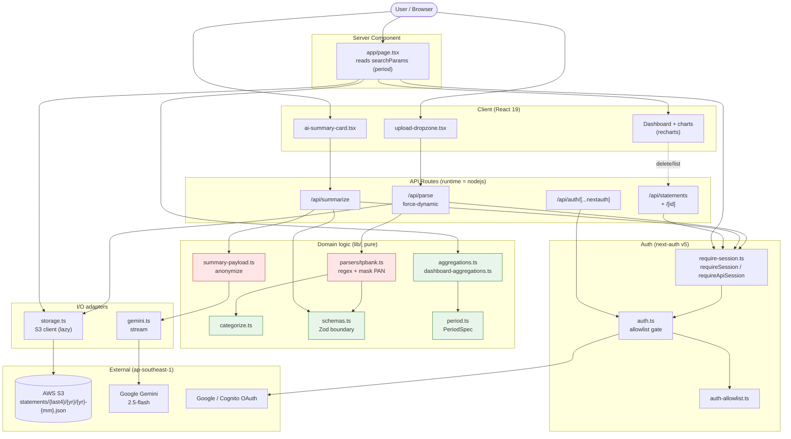
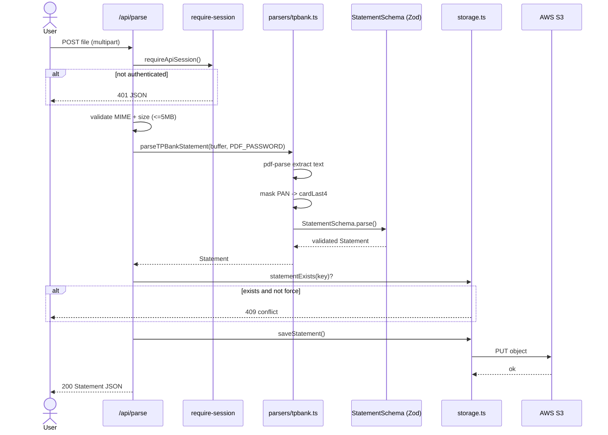
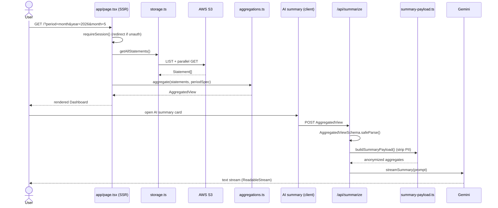

# Architecture Diagrams

Mermaid source for the Cashight architecture. Each block is independently
copy-paste-ready into [mermaid.live](https://mermaid.live) or any Mermaid-aware
renderer (GitHub, Obsidian, VS Code Mermaid preview).

## 1. System architecture (flowchart)

> Red nodes = PCI boundary (PAN masked / aggregates anonymized). Green = pure, side-effect-free modules.

## 2. Upload & parse flow (sequence)

## 3. Dashboard render & AI summary (sequence)

