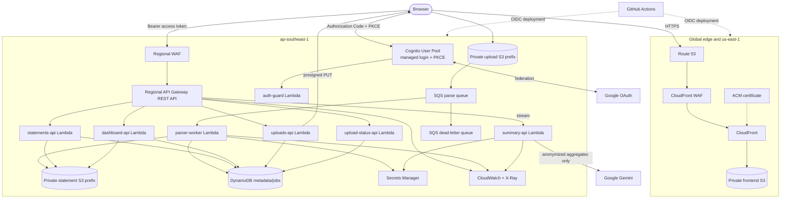

# Cashight Hybrid Serverless Architecture Design

**Status:** Approved for implementation planning
**Date:** 2026-06-27
**Owner:** Huy
**Scope:** Replace Amplify-hosted Next.js SSR with a static Next.js SPA and move backend logic to AWS Lambda while preserving Cashight's privacy and data-integrity guarantees.

## 1. Outcome

Cashight will become a hybrid serverless application with independently deployable frontend and backend boundaries:

- Next.js 16 produces a static export hosted in a private S3 bucket and delivered by CloudFront.
- Amazon Cognito owns authentication and federates Google sign-in through Cognito managed login.
- API Gateway authenticates requests with Cognito JWTs and routes them to domain-specific Lambda functions.
- S3 remains the source of truth for validated statement JSON and temporary PDF uploads.
- DynamoDB stores only queryable statement metadata, upload-job state, and idempotency records.
- SQS decouples PDF upload from parsing so parsing is not constrained by an API timeout.
- Terraform owns AWS resources, IAM, DNS, certificates, security controls, observability, and deployment roles.
- GitHub Actions builds immutable artifacts and performs controlled frontend and backend deployments using GitHub OIDC.

The migration is incremental. The existing Amplify application remains the production rollback target until the CloudFront-based deployment passes production smoke tests and an observation window.

## 2. Current Architecture Assessment

Cashight is currently a layered Next.js monolith deployed on Amplify `WEB_COMPUTE`:

- Dynamic server components in `app/page.tsx` and `app/statements/page.tsx` authenticate users and read S3 directly.
- Next.js route handlers implement parsing, statement access, deletion, and Gemini streaming.
- Auth.js handles Google and Cognito providers and enforces one `ALLOWED_EMAIL`.
- The Amplify compute role accesses the statement bucket and SSM SecureString parameters.
- S3 stores one validated statement document per card and month.
- Terraform already manages Amplify, Cognito, S3, IAM, WAF, CloudWatch alarms, GitHub OIDC, and remote state.

The current implementation has four architectural pressure points:

1. Amplify SSR packaging for `pdf-parse` and `pdfjs-dist` depends on a DOM polyfill and copied worker artifact.
2. Each dynamic dashboard render lists and downloads every statement from S3.
3. Authentication enforcement is repeated in each route because Next.js proxy middleware is not deployed by Amplify.
4. Frontend, backend, authentication configuration, and PDF runtime are deployed as one artifact and share one rollback boundary.

The following properties are working and must be preserved:

- PAN is converted to `cardLast4` immediately after extraction.
- S3 objects are validated with `StatementSchema.parse()` after reads and before use.
- Gemini receives anonymized aggregate payloads only.
- Vietnamese amounts remove `.` thousands separators only inside the TPBank parser.
- Re-uploading a statement month overwrites a deterministic key while S3 versioning preserves recovery history.
- Production runs in `ap-southeast-1`; CloudFront WAF and certificates use `us-east-1` where required.

## 3. Architectural Decisions

### AD-001: Static Next.js export

Set `output: 'export'` and `trailingSlash: true` in `next.config.ts`. Build output is `out/`. Every runtime-dependent page becomes a client-rendered route that calls the backend API. Next.js route handlers, Auth.js server code, redirects, request cookies, and server-only data access are removed from the frontend deployment.

CloudFront maps `/`, `/upload/`, `/statements/`, `/signin/`, and `/auth/callback/` to their generated `index.html` files. The mapping function appends `index.html` to paths ending in `/` and appends `/index.html` to extensionless paths.

### AD-002: CloudFront and private S3 replace Amplify Hosting

The frontend origin bucket blocks all public access and permits reads only from a CloudFront Origin Access Control. CloudFront provides TLS, compression, HTTP/2 or newer delivery, security headers, and cache separation:

- HTML and route payload files: `max-age=60`, short CloudFront TTL, invalidated during deployment.
- Hashed Next.js assets under `/_next/static/`: `max-age=31536000, immutable`.
- No cookies, authorization headers, or query strings are forwarded to the S3 origin.

The upload path has a separate S3 CORS policy that permits only `PUT` from `https://cashight.nghuy.link` with the exact signed headers. The statement prefix has no browser CORS policy because browsers never access it directly.

The existing CloudFront-scope WAF managed rule groups and rate-based rule move from the Amplify association to the new distribution.

### AD-003: Cognito is the only browser-facing identity provider

The SPA uses a public Cognito app client with no client secret and Authorization Code flow with PKCE. The SPA uses `oidc-client-ts` to perform OIDC discovery, redirect, callback processing, token refresh, logout, and session restoration.

Google remains available as a Cognito social identity provider. Users select Cognito credentials or Google from Cognito managed login; the SPA does not integrate with Google directly. The Google redirect URI becomes the Cognito federation endpoint rather than an Auth.js callback.

Tokens are stored in `sessionStorage`, not `localStorage`, and are attached only to the API origin as `Authorization: Bearer <access-token>`. This limits persistence across browser restarts but does not remove XSS risk; an enforcing content security policy remains required.

A Cognito auth-guard Lambda handles `PreSignUp_ExternalProvider` and rejects federated profiles whose verified email does not equal `ALLOWED_EMAIL`. The same function handles pre-token-generation events, rechecks the verified email, and upserts an authorized-user record keyed by the stable Cognito `sub`. API Lambdas require an OAuth access token, load that authorization record by `sub`, and verify resource ownership. They do not depend on an email claim being present in the access token. This is defense in depth; Cognito remains responsible for login and token issuance.

The Google client secret is required by `aws_cognito_identity_provider`. Terraform therefore receives it as a sensitive CI input and stores it in encrypted remote state. The state bucket must use a customer-managed KMS key, restrictive bucket policy, versioning, access logging, and least-privilege state access. The secret is never committed or emitted as an output.

### AD-004: Regional REST API Gateway

Use one Regional API Gateway REST API at `api.cashight.nghuy.link` with a Cognito User Pool authorizer. REST API is selected over HTTP API because the AI summary must preserve response streaming and API Gateway response streaming is supported for REST APIs. The summary integration is defined through an OpenAPI document with `responseTransferMode: STREAM` and the Lambda response-streaming invocation URI.

The API has exact CORS configuration for `https://cashight.nghuy.link`, explicit methods and headers, access logs, request IDs, stage throttling, method throttling for expensive routes, and a Regional WAF association. Authenticated API responses are not cached by CloudFront.

### AD-005: Domain-specific Lambda functions

Do not create one catch-all Lambda. Use the following bounded functions with independent roles, memory, timeout, concurrency, alarms, and deployment versions:

| Function | Trigger | Responsibility |
| --- | --- | --- |
| `auth-guard` | Cognito pre-sign-up and pre-token generation | Reject non-allowlisted users and register the authorized Cognito `sub` before issuing tokens. |
| `statements-api` | API Gateway | List metadata, return validated statement documents, and delete owned statements. |
| `dashboard-api` | API Gateway | Read period-specific statements, aggregate them with existing pure helpers, and return `AggregatedView`. |
| `uploads-api` | API Gateway | Validate an upload request, create a job, and return a presigned S3 PUT URL. |
| `upload-status-api` | API Gateway | Return the authenticated user's upload job state and conflict result. |
| `parser-worker` | SQS event source | Download the uploaded PDF, retrieve its password, parse, mask, validate, persist, update metadata, and finalize the job. |
| `summary-api` | API Gateway streaming proxy | Validate an `AggregatedView`, build the privacy-safe Gemini payload, and stream the generated response. |

Shared HTTP, auth-claim, logging, schema, error-mapping, and AWS-client helpers live under `backend/shared/`. Existing pure parsing, categorization, schema, period, aggregation, formatting, and summary-payload modules move to `packages/domain/` so frontend and backend code can import stable types without importing server adapters.

### AD-006: Asynchronous PDF processing

The browser never sends PDF bytes through API Gateway. The flow is:

1. SPA calls `POST /uploads` with file name, MIME type, byte size, SHA-256 checksum, and `force` flag.
2. `uploads-api` validates the request, creates a `PENDING_UPLOAD` job in DynamoDB, and returns a short-lived presigned PUT URL for an exact S3 key.
3. The browser uploads the PDF to `uploads/{userSub}/{jobId}.pdf` with the required content type and checksum.
4. S3 emits an object-created event to SQS.
5. `parser-worker` receives one record, transitions the job to `PROCESSING`, and parses the PDF.
6. The worker validates the statement, determines the deterministic statement key, and detects overwrite conflicts.
7. If the statement exists and `force` is false, the job becomes `CONFLICT` and the uploaded PDF is deleted.
8. Otherwise the worker writes validated JSON, writes DynamoDB metadata, marks the job `SUCCEEDED`, and deletes the uploaded PDF.
9. The SPA polls `GET /uploads/{jobId}` with bounded exponential backoff until a terminal state.

The SQS queue has a dead-letter queue, finite retry count, visibility timeout greater than the Lambda timeout, partial-batch response configuration, and batch size one. The worker is idempotent by job ID and checksum. A lifecycle rule deletes orphaned upload objects after one day and expired job records through DynamoDB TTL after seven days.

### AD-007: Hybrid S3 and DynamoDB data model

S3 remains the source of truth for transaction-level statement documents. Existing documents migrate from:

`statements/{cardLast4}/{year}/{year}-{mm}.json`

to:

`users/{userSub}/statements/{cardLast4}/{year}/{year}-{mm}.json`

DynamoDB contains no raw descriptions or transaction arrays. Use one table with on-demand billing, point-in-time recovery, deletion protection in production, server-side encryption, and the following item shapes:

| Item | PK | SK | Purpose |
| --- | --- | --- | --- |
| Statement metadata | `USER#{sub}` | `STATEMENT#{year}-{mm}#{cardLast4}` | S3 key, date, totals, transaction count, upload timestamp, checksum. |
| Upload job | `USER#{sub}` | `UPLOAD#{jobId}` | State, object key, force flag, safe error code, timestamps, TTL. |
| Idempotency record | `JOB#{jobId}` | `CHECKSUM#{sha256}` | Prevent duplicate SQS processing and repeated writes. |
| Authorized user | `AUTHZ#{sub}` | `PROFILE` | Verified allowlist decision and non-sensitive authorization metadata. |

The metadata access pattern replaces unbounded S3 listing and full object fan-out. `dashboard-api` queries metadata for the selected period, fetches only matching S3 documents, validates each document, and aggregates server-side.

### AD-008: Secrets

Create Secrets Manager secret metadata for `GEMINI_API_KEY`, `PDF_PASSWORD`, and the Google OAuth client secret. Secret values are supplied by protected GitHub environment secrets or a one-time operator action, never by committed Terraform variables. Lambda IAM permits each function to read only its required secret:

- `parser-worker`: PDF password only.
- `summary-api`: Gemini API key only.
- Cognito Google IdP provisioning: Google client secret only during Terraform apply.

The existing SSM parameters remain available during migration and are removed only after Lambdas use Secrets Manager successfully.

### AD-009: Observability and privacy

Use AWS Lambda Powertools for TypeScript for structured logging, metrics, tracing, idempotency, and SQS batch handling. Every request or job carries a correlation ID. Logs may include user-subject hashes, job IDs, safe error codes, object keys, `cardLast4`, counts, totals, and elapsed time. Logs must not include tokens, email addresses, names, full PANs, PDF bytes, passwords, Gemini keys, or raw transaction descriptions.

Create dashboards and alarms for:

- API Gateway 4xx, 5xx, latency, throttles, and streaming integration errors.
- Lambda errors, throttles, duration, concurrent executions, and iterator age.
- SQS oldest message age, visible messages, and DLQ depth.
- DynamoDB throttles and system errors.
- CloudFront 4xx/5xx rate and WAF blocked requests.
- Parser business outcomes and upload jobs stuck outside terminal states.

Alarms route to the existing optional SNS notification topic. X-Ray active tracing is enabled on API Gateway and Lambdas, but trace annotations contain no PII.

### AD-010: Deployment and rollback

Use three workflows:

1. `ci.yaml`: typecheck, lint, unit tests, static export build, backend bundle build, dependency audit, and privacy checks.
2. `infrastructure-deploy.yaml`: Terraform format, validate, plan artifact, protected-environment approval, and apply through GitHub OIDC.
3. `application-deploy.yaml`: publish backend artifacts, deploy Lambda versions through aliases and CodeDeploy canaries, then upload frontend immutable assets followed by HTML and targeted CloudFront invalidation.

Frontend deployment order is immutable assets first, route HTML second, and `index.html` last. Each release stores a manifest containing Git SHA, object keys, and checksums. Rollback restores the prior HTML release pointer and invalidates only HTML paths.

Each API integration invokes a `live` Lambda alias. CodeDeploy shifts 10 percent of traffic for five minutes and rolls back when function-error, API-5xx, or latency alarms breach. DynamoDB changes are additive; destructive attribute migrations are prohibited.

## 4. Target Topology



## 5. API Contract

All routes except `/health` require a Cognito access token. Error bodies use `{ "error": { "code": string, "message": string, "requestId": string } }`. Messages contain no sensitive values.

| Method | Route | Function | Result |
| --- | --- | --- | --- |
| `GET` | `/health` | `statements-api` | Deployment health without dependency details. |
| `GET` | `/statements?year=&month=&cursor=` | `statements-api` | Paginated statement metadata owned by the caller. |
| `GET` | `/statements/{statementId}` | `statements-api` | Validated statement JSON owned by the caller. |
| `DELETE` | `/statements/{statementId}` | `statements-api` | Deletes S3 object and metadata with idempotent semantics. |
| `GET` | `/dashboard?period=&year=&month=&quarter=` | `dashboard-api` | Validated `AggregatedView` for the requested period. |
| `POST` | `/uploads` | `uploads-api` | Upload job plus five-minute presigned PUT URL. |
| `GET` | `/uploads/{jobId}` | `upload-status-api` | Job state: `PENDING_UPLOAD`, `PROCESSING`, `CONFLICT`, `SUCCEEDED`, or `FAILED`. |
| `POST` | `/summaries` | `summary-api` | Streamed UTF-8 summary from an anonymized aggregate payload. |

The backend never accepts an S3 key or user subject from the browser as an authorization decision. It derives `sub` from authorizer claims and constructs keys internally.

## 6. Terraform Structure

Retain one production state during migration to avoid cross-state dependency complexity. Refactor resources into local modules only after adding Terraform `moved` blocks for every existing address.

```text
terraform/
  backend.tf
  main.tf
  variables.tf
  outputs.tf
  versions.tf
  moved.tf
  api-openapi.yaml.tftpl
  modules/
    edge/
      main.tf
      variables.tf
      outputs.tf
    auth/
      main.tf
      variables.tf
      outputs.tf
    data/
      main.tf
      variables.tf
      outputs.tf
    api/
      main.tf
      variables.tf
      outputs.tf
    compute/
      main.tf
      variables.tf
      outputs.tf
    observability/
      main.tf
      variables.tf
      outputs.tf
    cicd/
      main.tf
      variables.tf
      outputs.tf
```

Module rules:

- Modules receive resource identifiers explicitly and do not read remote state.
- Each Lambda receives a dedicated IAM role; wildcard actions and resources require an explicit documented exception.
- Production S3 buckets, DynamoDB table, KMS keys, and Cognito pool use `prevent_destroy` or service deletion protection.
- Existing resources are moved in state; they are not recreated merely to fit module boundaries.
- `terraform plan` must show no unintended replacement or deletion before every migration phase.
- Amplify resources remain declared until DNS cutover, smoke tests, and rollback observation complete.

## 7. Application Repository Structure

```text
app/                         # static Next.js routes and client components
components/ui/               # existing shared UI primitives
frontend/
  auth/                      # OIDC client, callback, token/session provider
  api/                       # typed API client and error handling
  hooks/                     # data fetching and upload polling
backend/
  functions/
    auth-guard/
    statements-api/
    dashboard-api/
    uploads-api/
    upload-status-api/
    parser-worker/
    summary-api/
  shared/
    api-response.ts
    auth-claims.ts
    clients.ts
    logging.ts
    storage.ts
    metadata.ts
packages/
  domain/                    # schemas, parser, categorization, aggregation
scripts/
  build-lambdas.mjs
  deploy-frontend.mjs
  migrate-statements.ts
```

The domain package has no Next.js, browser, Lambda, or AWS SDK dependency. Browser code cannot import backend modules. Lambda handlers remain thin and delegate to domain or shared adapters.

## 8. Migration Sequence

### Phase 0: Safety baseline

- Add production smoke tests for sign-in, dashboard load, statement listing, PDF upload, conflict handling, delete, and AI summary.
- Export current Terraform state and S3 inventory; verify bucket versioning.
- Record current Amplify URL and deployment as the rollback target.
- Add tests that fail if PAN-like values or raw transaction descriptions enter logs or summary payloads.

### Phase 1: Domain extraction and Lambda-compatible build

- Move pure business modules to `packages/domain/` without behavior changes.
- Keep compatibility imports so the Amplify deployment remains functional.
- Build and test Lambda artifacts with the existing PDF fixture and pdfjs worker.

### Phase 2: Data and asynchronous parser

- Provision DynamoDB, SQS, DLQ, upload path policies, Secrets Manager metadata, parser Lambda, and alarms.
- Implement presigned upload and job status APIs.
- Run the new upload path behind a frontend feature flag while existing `/api/parse` remains available.

### Phase 3: Read APIs and metadata migration

- Backfill statement metadata and user-prefixed S3 objects with an idempotent migration script.
- Resolve the target `userSub` from the authorized-user DynamoDB record created during Cognito token issuance, require it as an explicit migration-script argument, and abort if no active authorization record exists.
- Compare old and new statement counts, keys, totals, and aggregate outputs.
- Deploy statements and dashboard APIs and switch frontend reads behind a feature flag.

### Phase 4: Cognito SPA authentication

- Add the public PKCE client without deleting the existing confidential Auth.js client.
- Configure Google federation and allowlist trigger.
- Convert sign-in, callback, session, navigation, and API requests to client-side Cognito OIDC.
- Verify native Cognito and Google sign-in before disabling Auth.js paths.

### Phase 5: Static frontend and edge cutover

- Provision private frontend bucket, CloudFront OAC distribution, security headers, ACM certificate, Route 53 records, and WAF.
- Deploy the static export to a temporary CloudFront hostname and run end-to-end tests.
- Lower DNS TTL, point `cashight.nghuy.link` to CloudFront, and monitor alarms.
- Keep Amplify and the prior DNS value available for rollback.

### Phase 6: Streaming summaries and controlled deployments

- Deploy the response-streaming REST integration and summary Lambda alias.
- Add frontend/backend workflow separation, Lambda canary deployment, release manifests, and automated rollback alarms.
- Verify streaming behavior using an uncached client and production custom domain.

### Phase 7: Decommission

- After a seven-day healthy observation window, disable Amplify deployment jobs.
- Remove Auth.js runtime secrets and old callbacks.
- Remove old SSM parameters only after Secrets Manager reads are verified.
- Remove Amplify resources and obsolete IAM policies through a reviewed Terraform plan.
- Retain S3 object versions and migration manifests according to the recovery policy.

## 9. Failure Handling

- Invalid or expired JWT: API Gateway returns 401 before Lambda invocation.
- Valid token without application permission: Lambda returns 403.
- Invalid upload metadata: `uploads-api` returns 400 without issuing a URL.
- Upload checksum or size mismatch: S3 PUT fails or worker marks the job `FAILED` with a safe error code.
- Parser validation error: job becomes `FAILED_PARSE`; uploaded PDF is deleted after diagnostic metadata is recorded.
- Existing statement without force: job becomes `CONFLICT`; no statement object changes.
- SQS retries exhausted: message enters DLQ and an alarm fires.
- DynamoDB unavailable after a statement write: idempotency record and deterministic S3 key make retry safe.
- Gemini unavailable before stream headers: return 429, 502, or 503 as appropriate.
- Gemini failure after stream starts: terminate the stream, emit a safe structured error metric, and let the client offer retry.
- Frontend deployment failure before HTML upload: current release remains active.
- Lambda canary alarm: CodeDeploy restores the prior `live` alias version.

## 10. Security Controls

- Enforce TLS for every S3 bucket and API/custom domain.
- Use OAC; do not enable S3 website hosting or public bucket access.
- Use exact CORS origins and methods; never use wildcard origin with bearer tokens.
- Use a public Cognito client with PKCE and no embedded client secret.
- Validate token issuer, audience/client, expiry, and required scopes at API Gateway.
- Enforce the email allowlist in Cognito triggers; enforce authorized-subject and resource ownership checks in API Lambdas.
- Derive all S3 and DynamoDB keys from authenticated claims and validated server data.
- Validate external data with Zod at API, S3, SQS, and Gemini boundaries.
- Configure WAF managed rules, request-size controls, and rate-based rules at frontend and API edges.
- Configure API throttling and reserved concurrency for parser and summary functions.
- Encrypt S3, DynamoDB, secrets, logs, artifacts, and Terraform state.
- Run the existing log scanner against Lambda and API access-log samples before cutover.

## 11. Testing Strategy

- Domain unit tests preserve parser, categorization, period, aggregation, schema, and summary privacy behavior.
- Handler unit tests cover JWT claim extraction, ownership, request validation, error mapping, and idempotency.
- Infrastructure tests run `terraform fmt`, `terraform init -backend=false`, `terraform validate`, TFLint, and policy checks.
- Contract tests invoke every API route with missing, invalid, disallowed, and allowed tokens.
- Integration tests use isolated S3 prefixes and DynamoDB keys and verify cleanup.
- Parser integration tests use the canonical gitignored TPBank fixture and self-skip when absent.
- End-to-end tests cover both Cognito credentials and Google federation, static deep links, session restore, upload polling, conflict overwrite, dashboard parity, deletion, and summary streaming.
- Migration reconciliation compares object counts, metadata counts, per-statement totals, and aggregate hashes before frontend read cutover.
- Disaster tests verify DLQ alarms, Lambda rollback, frontend rollback, and DNS rollback procedures.

## 12. Acceptance Criteria

The migration is complete only when all of the following are true:

1. `pnpm build` produces a static `out/` directory with no server runtime artifact.
2. All application routes load directly and through client-side navigation from CloudFront.
3. The frontend S3 bucket is inaccessible publicly and accessible only through CloudFront OAC.
4. Cognito credentials and Google federation both complete Authorization Code + PKCE through the public app client.
5. API Gateway rejects invalid JWTs and Lambdas reject non-allowlisted or non-owning users.
6. No PDF bytes pass through API Gateway.
7. PDF uploads complete through S3, SQS, parser Lambda, S3 statement storage, and DynamoDB job transitions.
8. Re-upload conflict and force-overwrite behavior matches the existing application.
9. Dashboard and statement outputs match the existing implementation for the same S3 data.
10. Gemini receives only anonymized aggregates and streams successfully through the REST API.
11. Terraform manages every AWS resource and produces no unexpected destroy or replacement during migration.
12. Frontend rollback, Lambda canary rollback, and DNS rollback procedures have been exercised.
13. CloudWatch dashboards and alarms cover API, Lambda, SQS, DynamoDB, CloudFront, and WAF.
14. Production log samples pass `pnpm security:scan-logs` and contain no prohibited data.
15. Amplify is removed only after the seven-day healthy observation window.

## 13. Explicit Non-Goals

- Multi-tenant billing or organization support.
- Moving raw transaction records into DynamoDB.
- Direct browser access to statement S3 objects.
- A custom login API in Lambda.
- CloudFront caching of authenticated API responses.
- Multi-region active-active deployment.
- Replacing Gemini or the TPBank statement format.
- Rewriting the existing UI design beyond changes required for client-side loading, auth, and upload progress.

## 14. References

- [Production-Grade Serverless Web App Architecture](https://dev.to/aws-builders/production-grade-serverless-web-app-architecture-on-aws-with-cloudfront-s3-api-gateway-lambda-1646)
- [Next.js static exports](https://nextjs.org/docs/app/guides/single-page-applications)
- [Amazon Cognito PKCE](https://docs.aws.amazon.com/cognito/latest/developerguide/using-pkce-in-authorization-code.html)
- [Amazon Cognito social identity providers](https://docs.aws.amazon.com/cognito/latest/developerguide/cognito-user-pools-identity-provider.html)
- [API Gateway Cognito User Pool authorizers](https://docs.aws.amazon.com/apigateway/latest/developerguide/apigateway-integrate-with-cognito.html)
- [API Gateway response streaming](https://docs.aws.amazon.com/apigateway/latest/developerguide/response-transfer-mode.html)
- [SQS partial batch response guidance](https://docs.aws.amazon.com/prescriptive-guidance/latest/lambda-event-filtering-partial-batch-responses-for-sqs/best-practices-partial-batch-responses.html)
